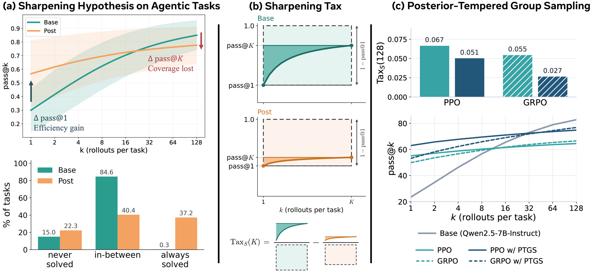

# Sharpening Tax in Post-Training

<p align="center">
  Changdae Oh<sup>1,2,*</sup>,
  Qi Zeng<sup>1</sup>,
  Qi Qi<sup>1</sup>,
  Andrey Zhmoginov,
  Deren Lei<sup>1</sup>,
  Yun He<sup>1</sup>,
  Hoang Phan<sup>1,3,*</sup>,
  <br>
  Hangoo Kang<sup>4</sup>,
  Azalia Mirhoseini<sup>4</sup>,
  Sharon Li<sup>2</sup>
</p>
<p align="center">
  <sup>1</sup>Meta Superintelligence Labs &nbsp; <sup>2</sup>University of Wisconsin–Madison &nbsp; <sup>3</sup>New York University &nbsp; <sup>4</sup>Stanford University
  <br><sup>*</sup>Work done at Meta
</p>
<p align="center">
  <a href="https://changdaeoh.github.io/sharpening-tax/"></a>
  <!-- <a href="https://arxiv.org/abs/XXXX.XXXXX"></a> -->
</p>

<p align="center"></p>

Does RL post-training give a language-model agent new capabilities, or does it merely
**sharpen** behaviors its base model already has? We compare 14 open base/post-trained
checkpoint pairs from four model families on three agentic benchmarks (BFCL v4 multi-turn,
WebShop and ACEBench), with 128 rollouts per task.

- **Base models are capable agents.** With a light text harness, pre-trained base models solve
  agentic tasks and, given enough rollouts, often reach more tasks (pass@k) than their
  post-trained counterparts. Post-training pushes tasks toward two extremes, always solved or
  never solved, trading solution coverage for sampling efficiency and consistency.
- **Sharpening Tax.** A diagnostic metric for the test-time scalability lost in post-training.
  It is positive in most of the 42 model-benchmark cases, can be estimated from a few
  rollouts, and correlates well with other metrics.
- **PTGS.** Posterior-tempered group sampling sets each prompt's rollout temperature from a
  Bayesian estimate of its difficulty. Applied during RL training, it pays a smaller tax than
  the fixed-temperature baseline while also improving single-shot accuracy.

## Getting started

This repository provides minimal working examples for understanding the project; it is not a
reproduction package. Benchmark checkouts, model serving environments and RL training
infrastructure are left to you. The metrics and PTGS run on CPU with numpy:

```bash
pip install -r requirements.txt
python -m ptgs                    # PTGS tempering rule, target ramp and one prompt's trajectory
python examples/ptgs_toy.py       # PTGS vs. fixed-temperature RL on a toy task (~2 s)
python -m pytest                  # 70 tests
```

Compute the Sharpening Tax from the example per-task outcomes:

```python
from sharpening_tax.metrics import Pair
from sharpening_tax.outcomes import load_table

cells = load_table("data/outcomes_42cells.csv.gz")  # {(benchmark, pair, arm): {task_id: (c, n)}}
tax = Pair(cells["webshop", "gemma-4-31B", "base"], cells["webshop", "gemma-4-31B", "rl"]).tax([128])
print(tax[128]["tax_A"], tax[128]["tax_S"])          # 4.49 0.036
```

See [`sharpening_tax`](sharpening_tax/) for collecting your own rollouts with the text harness,
and [`ptgs`](ptgs/) for adding PTGS to an RL trainer.

## Repository

| | |
|---|---|
| [`sharpening_tax`](sharpening_tax/) | Text harness for base models, rollout runners for BFCL / WebShop / ACEBench, and the pass@k, pass^k and Sharpening Tax metrics |
| [`ptgs`](ptgs/) | PTGS controller and the places it touches a group-based RL trainer |
| [`data`](data/) | Example per-task success counts (14 base / post-trained pairs × 3 benchmarks, 128 rollouts per task) |
| [`configs`](configs/) | Example RL configuration with PTGS (a record, not a launcher) |
| [`scripts`](scripts/) | vLLM serving recipe for each model family |
| [`examples`](examples/) | PTGS on a toy task |

## Citation

If you find our work helpful, we would appreciate it if you could cite our paper:

```bibtex
@article{oh2026sharpening,
  title   = {Sharpening Tax in Post-Training},
  author  = {Oh, Changdae and Zeng, Qi and Qi, Qi and Zhmoginov, Andrey and Lei, Deren and
             He, Yun and Phan, Hoang and Kang, Hangoo and Mirhoseini, Azalia and Li, Sharon},
  journal = {arXiv preprint},
  year    = {2026}
}
```

## License

This project is licensed under [CC BY-NC 4.0](LICENSE). See also [THIRD_PARTY_NOTICES.md](THIRD_PARTY_NOTICES.md).